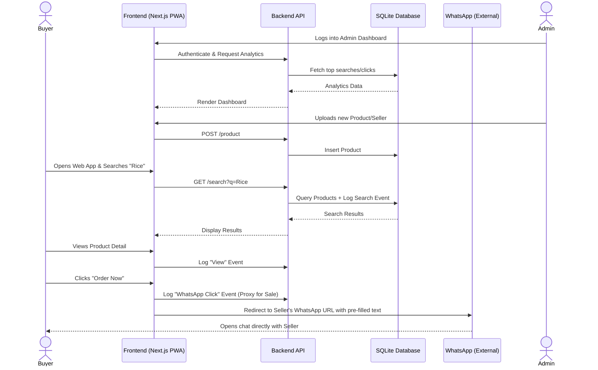
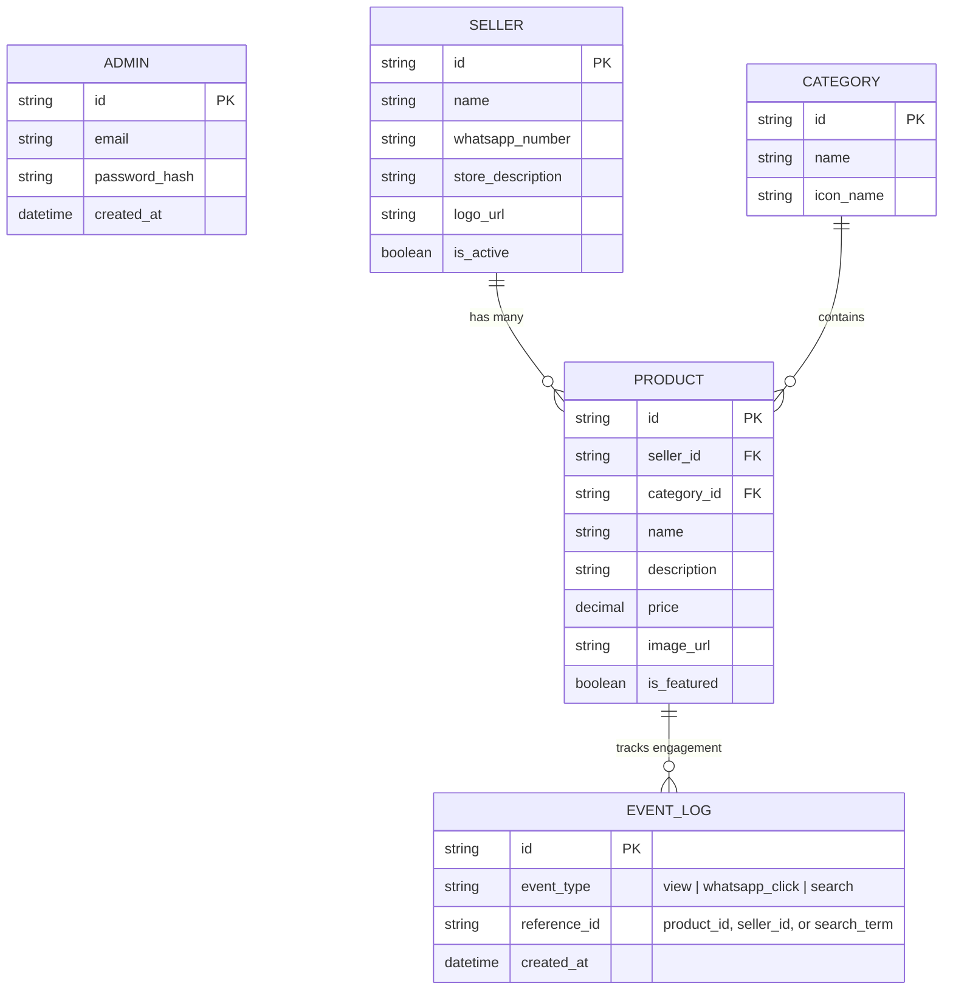

# PRD — Project Requirements Document

## 1. Overview
**Product Vision:** To empower underserved and rural communities by providing a highly accessible, low-friction hyperlocal marketplace that connects them with local sellers using familiar communication tools.

**Problem Statement:** People in rural areas with low digital literacy often struggle to navigate complex e-commerce platforms. They face barriers like mandatory account creation, confusing checkout processes, and digital payment requirements. Local sellers miss out on digital reach because setting up and managing online stores is too complicated.

**Objective:** Ecosera is a Progressive Web App (PWA) MVP designed specifically for simplicity and speed. It serves as a digital catalog for local sellers managed centrally by the founder. Buyers can easily browse products, search for what they need, and complete their purchases directly through WhatsApp—requiring no user accounts, no profiles, and no in-app payments. 

## 2. Requirements
**Target Users:** 
*   **Buyers:** Individuals in rural areas with low digital literacy who prefer simple interfaces and are already comfortable using WhatsApp.
*   **Admin:** The founder, who manages all store data and tracks performance.

**Key Constraints & Design Principles:**
*   **Platform:** Web-first Progressive Web App (PWA) optimized for mobile devices.
*   **UX/UI Direction:** Inspired by Walmart.com's clean structure. Simple essential navbar, strong primary blue color, large typography using the 'Inter' font for high readability, and high visual clarity designed for low digital literacy.
*   **Frictionless Experience:** No buyer login, no buyer profiles, no shopping cart, and no in-app checkout.

**Non-Goals (What we are NOT building yet):**
*   In-app payment gateways (Stripe, PayPal, etc.).
*   A seller-facing portal (sellers are entirely passive for the MVP).
*   Multi-item shopping carts (1-click redirect per item).
*   Complex algorithmic recommendations.

**Success Metrics (Proxy for fast iteration):**
*   Number of clicks on the WhatsApp "Order Now" button (proxy for top-selling products).
*   Most viewed product pages.
*   Top searched keywords (to understand local demand).
*   Number of active catalog items and sellers.

## 3. Core Features

**Buyer Side (Public):**
*   **Walmart-Inspired Homepage:** A clean mobile-first layout featuring a prominent search bar, minimal category browsing, and featured local sellers/products.
*   **High-Priority Search Bar:** Easy-to-use search functionality optimized for finding specific local goods quickly.
*   **Seller Shop Page:** A dedicated page displaying all products available from a specific local seller.
*   **Product Detail Page:** Clear product photos, simple descriptions, prices, and the primary call-to-action.
*   **WhatsApp "Order Now" Button:** A prominent button that opens the buyer's WhatsApp app, pre-filling a message to the seller with the product name, price, and inquiry.

**Admin Side (Private / Internal):**
*   **Secure Admin Authentication:** A private login portal for the founder.
*   **Seller & Catalog Management:** Simple forms to create seller profiles (name, WhatsApp number), add product categories, upload product photos, and set prices/details.
*   **Analytics Dashboard:** A centralized view displaying essential MVP metrics:
    *   Top clicked products (proxy for "Top Selling").
    *   Most viewed products.
    *   Most searched keywords.
    *   Top performing sellers.

## 4. User Flow

**Buyer Journey (Purchasing a Product):**
1.  **Launch:** Buyer opens the Ecosera PWA link on their phone (or from their home screen).
2.  **Discover:** Buyer uses the prominent search bar or taps a featured category/seller on the home screen.
3.  **Evaluate:** Buyer taps on a product to view its picture, price, and simple details.
4.  **Action:** Buyer taps the large "Order via WhatsApp" button.
5.  **Checkout:** The buyer's WhatsApp application opens with a pre-written message to the seller (e.g., "Hi, I am interested in buying [Product Name] for [Price]").

**Admin Journey (Managing the Catalog):**
1.  **Login:** Founder navigates to the hidden admin route and logs in securely.
2.  **Add Seller:** Founder creates a new seller profile, entering their business name and WhatsApp number.
3.  **Add Product:** Founder uploads a product photo, links it to the seller, assigns a category, and sets a price.
4.  **Review:** Founder opens the dashboard to see which products received the most WhatsApp clicks this week.

## 5. Architecture
The architecture follows a modern, lean client-server model. The PWA provides a fast, app-like experience on mobile. The frontend handles all UI rendering and passes WhatsApp redirect events to the backend to power the analytics dashboard.

## 6. Database Schema
To support the MVP constraints, we need a lightweight, relational database focusing on Sellers, Products, and simple Analytics tracking.

**Tables Overview:**
*   **Admin:** Stores founder credentials.
*   **Seller:** Stores local vendor details and their WhatsApp contact.
*   **Category:** Broad classifications for the minimal category browsing.
*   **Product:** Individual items linked to a seller and category.
*   **EventLog:** Tracks searches, page views, and WhatsApp clicks to populate the admin dashboard.

## 7. Tech Stack
Given the requirements for speed, MVP focus, and a PWA approach, the following modern JavaScript stack is recommended:

*   **Frontend & Backend Framework:** **Next.js (App Router)** - Allows building a seamless web experience with fast server-side rendering, which is great for low-end mobile devices. Easily configured as a PWA using `next-pwa`.
*   **Styling & UI:** **Tailwind CSS** + **shadcn/ui** - Provides rapid styling capabilities. Tailwind will be configured with the specific Walmart-inspired strong blue primary color and utilize the **'Inter' font** (optimized via `next/font`) for high readability. shadcn/ui ensures clean, accessible, mobile-first components.
*   **Database:** **SQLite** (via Turso or local file) - Perfect for an MVP. Extremely fast, zero configuration required, and handles <100 scale effortlessly.
*   **ORM:** **Drizzle ORM** - Lightweight and type-safe way to interact with the SQLite database.
*   **Authentication (Admin only):** **Better Auth** - Simple implementation to secure the internal dashboard for the founder without bloating the app.
*   **Deployment:** **Netlify** - Provides robust, zero-configuration deployment with excellent support for Next.js, edge networks, and built-in CI/CD.

## 8. Cart (MVP v1.1 — Optional Layer)
*   Client-side only
*   Uses IndexedDB
*   No backend persistence
*   No bulk checkout (users still order items individually)
*   Functions strictly as a 'saved items' list